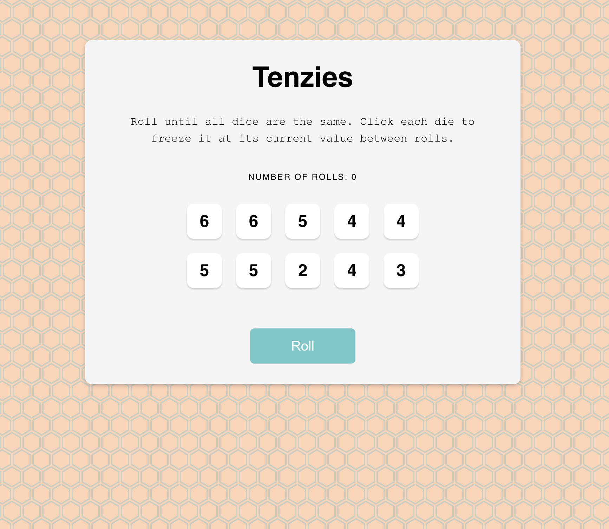

# Tenzies game made with create react app

## Table of contents

- [Overview](#overview)
  - [Screenshot](#screenshot)
  - [Links](#links)
- [My process](#my-process)
  - [Built with](#built-with)
  - [What I learned](#what-i-learned)
  - [Continued development](#continued-development)
  - [Useful resources](#useful-resources)
- [Author](#author)

## Overview

### Screenshot

### Links

- Solution URL: [https://github.com/Rae1821/tenzies-game]
- Live Site URL: [https://create-react-app-tenzies-game.netlify.app/]

## My process

### Built with

- Semantic HTML5 markup
- CSS custom properties
- Flexbox
- CSS Grid
- Mobile-first workflow
- [React](https://reactjs.org/) - JS library

### What I learned

This was a project for the React course at Scrimba.com. I struggled quite a bit with this project and it was very frustrating, however I also learned a lot.

This project helped me get more comfortable understanding the purpose of state and how to use it.

In addition to the parts of the project we went through in class, I also added a number of rolls section where the user can see how many rolls he has completed so far. Once the user wins the game it will display the total rolls it took to win. I also added in fun background and changed the colors. 

### Continued development

I plan on continuing to work on the skills I learned in this project to help solidify them in my mind. I am working on another project using React as well as the solo project for the React class.

### Useful resources

- [Create React App Documentation](https://create-react-app.dev/docs/getting-started) - React has great documentation and I spent a lot of time reading about using hooks like useState and useEffect which helped me understand it a little more.
- [Hero Patterns](https://heropatterns.com/) - I used one of these super fun svg background patterns for my project and it was super easy and fun.

## Author

- Website - [Rachel Dooley](https://www.rachelandersondooley.com)
- Twitter - [@racheladooley](https://www.twitter.com/racheladooley)

